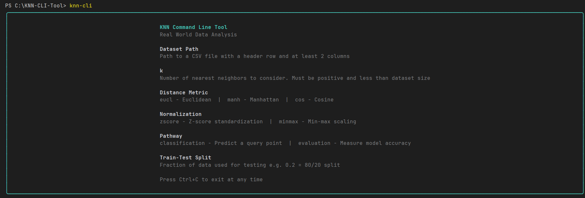
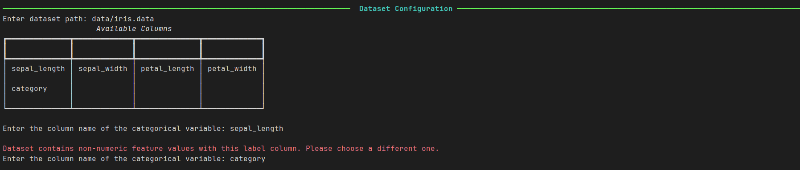
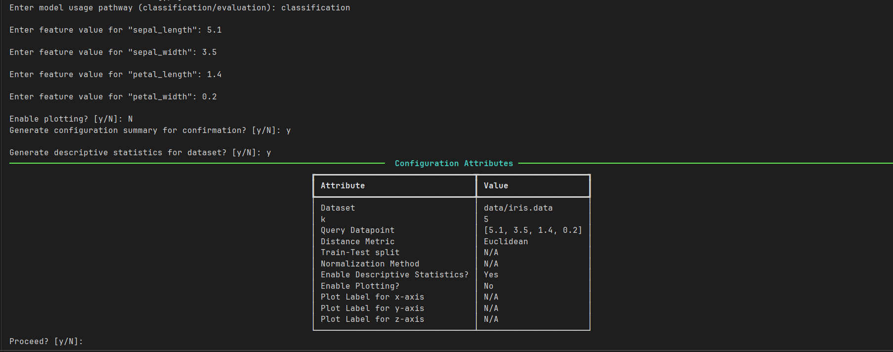
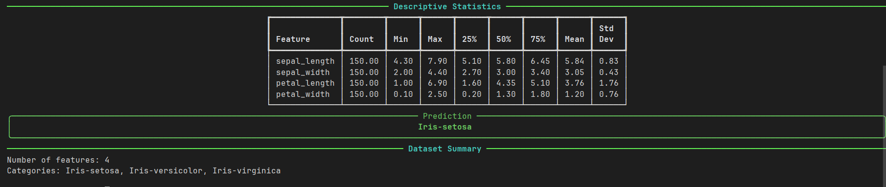
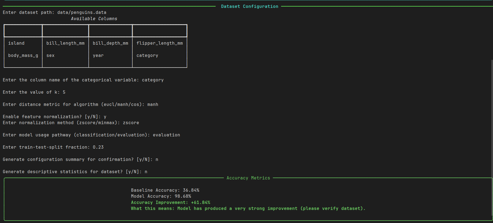
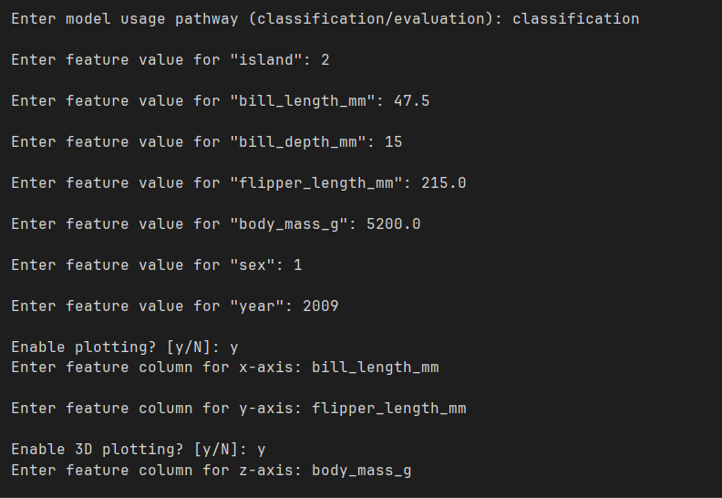
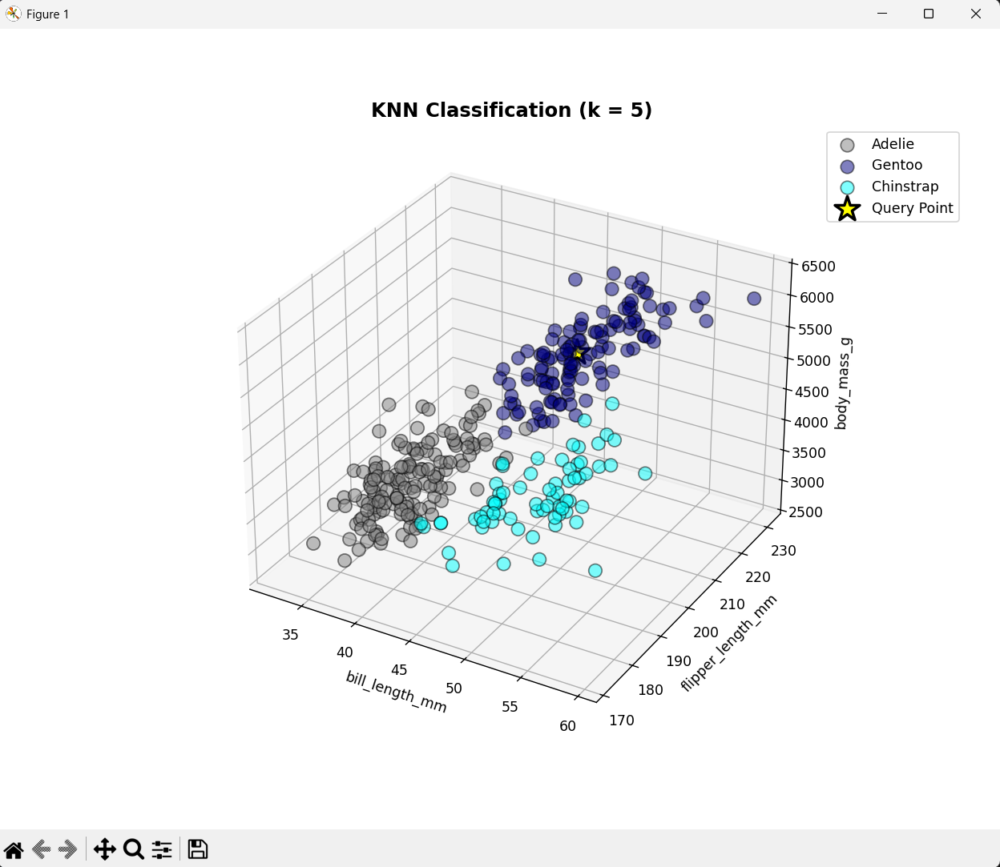

# KNN CLI Tool

> A fully interactive, terminal-native K-Nearest Neighbors classifier built from scratch — no scikit-learn, no shortcuts.

---

## What This Is

This tool implements the KNN algorithm from the ground up — distance metrics, normalization, train-test splitting, baseline accuracy comparison, descriptive statistics, and 2D/3D visualization — all surfaced through a prompt-driven CLI that guides the user step by step, validates every input in real time, and produces Rich-formatted terminal output.

Built as a first-semester CS lab assignment. Grew into something worth putting on a resume.

---

## Features

- **Interactive prompt-based CLI** — no flags, no documentation needed to get started
- **Classification** — predict the class of a query point against a labeled dataset
- **Evaluation** — measure model accuracy against a baseline using train-test splitting
- **Distance metrics** — Euclidean, Manhattan, Cosine
- **Feature normalization** — Z-score standardization, Min-Max scaling
- **Descriptive statistics** — count, mean, median, std dev, quartiles per feature
- **Visualization** — 2D and 3D scatter plots with per-category color coding and query point highlighting
- **Per-prompt validation** — every input is validated immediately with a clear error and re-prompt on failure
- **Flexible dataset support** — any CSV column can be the categorical label, not just the last one

---

## Installation

**Requirements:** Python 3.10+

```bash
git clone https://github.com/arnavmer-935/knn-cli.git
cd KNN-CLI-Tool
pip install -e .
```

---

## Usage

```bash
knn-cli
```

That's it. The tool walks you through everything interactively.

A help reference is displayed at launch covering all valid inputs and options. Press `Ctrl+C` at any time to exit cleanly.

---

## What the Prompts Look Like

## Screenshots

### Welcome Panel


### Columns and Choosing Categorical Variable


### Dataset Configuration


### Dataset Stats and Classification Result


### Evaluation Result


### Plot Prompts


### 3D Scatter Plot


---

## Dataset Requirements

- CSV format with a header row
- At least 2 columns
- All feature columns must be numeric
- One column must contain categorical class labels (can be any column)

Three sample datasets are included in `data/`:

| Dataset | Points | Features | Classes |
|---|---|---|---|
| `iris.data` | 150 | 4 | 3 |
| `penguins.data` | 333 | 6 | 3 |
| `words.data` | 400,000 | 50 | — |

The word vectors dataset (`words.data`) contains GloVe pre-trained word embeddings and is included as a stress test for high-dimensional inputs.

---

## Running Tests

```bash
python -m pytest tests/
```

Test coverage includes:
- KNN core (distance calculation, neighbor selection, classification voting)
- All three distance metrics
- Both normalization methods
- Train-test splitting and accuracy evaluation
- Descriptive statistics
- Dataset loading and column parsing
- CLI error handling

---

## Project Structure

```
KNN-CLI-Tool/
├── knn_cli/
│   ├── cli.py                  # Entry point, interactive prompts, output rendering
│   ├── knn.py                  # Core KNN algorithm
│   ├── distance_metric.py      # Euclidean, Manhattan, Cosine
│   ├── normalization.py        # Z-score and Min-Max scaling
│   ├── train_test_splitting.py # Splitting, accuracy, baseline accuracy
│   ├── statistics.py           # Descriptive statistics
│   ├── visualization.py        # 2D/3D scatter plots
│   ├── data_loader.py          # CSV parsing
│   └── data_utils.py           # Shared types, validation, dataclasses
├── tests/
│   ├── test_knn_classification.py
│   ├── test_distance_metric.py
│   ├── test_normalization_methods.py
│   ├── test_train_test_splitting.py
│   ├── test_statistics.py
│   ├── test_data_loader.py
│   ├── test_knn_cli.py
│   └── test_tool_error_handling.py
├── data/
│   ├── iris.data
│   ├── penguins.data
│   └── words.data
├── pyproject.toml
├── requirements.txt
└── README.md
```

---

## Tech Stack

| Library | Purpose |
|---|---|
| [Typer](https://typer.tiangolo.com/) | CLI framework and interactive prompts |
| [Rich](https://rich.readthedocs.io/) | Terminal formatting, tables, panels |
| [Matplotlib](https://matplotlib.org/) | 2D and 3D scatter plot generation |

No ML libraries. The algorithm is implemented from scratch.

---

## Benchmark Results

Evaluated on the [WDBC dataset](https://archive.ics.uci.edu/dataset/17/breast+cancer+wisconsin+diagnostic) (569 instances, 30 features) across 10 runs with k=9, Euclidean distance, Min-Max normalization, and a 0.25 train-test split.

| Metric | Value |
|---|---|
| Average Model Accuracy | 96.76% |
| Average Baseline Accuracy | 62.67% |
| Average Accuracy Improvement | +34.09% |
| Accuracy Range | 95.07% – 98.59% |

Baseline accuracy reflects a naive classifier that always predicts the majority class. The model's low variation across runs (model accuracy range of 3.52%) indicates a stable performance regardless of the split.

## License

MIT
